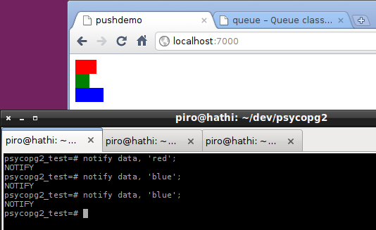

=========================================
*Psycopg*: bridging PostgreSQL and Python
=========================================

.. image:: img/psycopg.png
    :height: 30em

.. class:: text-right

    Boulder Linux Users Group, ``'2020-04-09'::date``

    Daniele Varrazzo

    `slides source <https://github.com/dvarrazzo/psycopg-boulder-2020/>`__
..
    Note to piro: you want
    :autocmd BufWritePost psycopg.rst :silent !make html

----

What are we talking about?
==========================

* There is this language, Python 🐍

  * it's got all its types (strongly typed, dynamically typed)

* and this database, PostgreSQL 🐘

  * yeah, not a great name. Let's call it Postgres
  * it's got a lot of different types too

* You want to do something with the two 🐍↔️🐘

  * they are both very extendible
  * someone should map the two together

----

Mapping the two together
========================

Psycopg!
--------

* Yeah, maybe questionable name too. 🤔
* But now we sort of like it. 🤭

``psycopg2``
------------

.. role:: html(raw)
    :format: html

* Current mature adapter: in production for about 15 years 👴
* https://www.psycopg.org/

``psycopg3``
------------

* Development recently started. Exciting! 👶
* https://www.varrazzo.com/blog/2020/03/06/thinking-psycopg3/
* Please `support the project <https://github.com/sponsors/dvarrazzo/>`__ 💜

----

Basic usage
===========

The roles of the main actors

.. code-block:: python

    import psycopg2                             # the driver
    conn = psycopg2.connect("dbname=piro")      # the connection/session
    cur = conn.cursor()                         # the cursor - holds a result

    cur.execute("select 10 as a, 'foo' as b")   # sends command
    cur.fetchone()                              # retrieve results
    conn.commit()                               # controls the session

Different ways to consume data

.. code-block:: python

    cur.fetchone()      # returns one tuples
    cur.fetchmany(n)    # returns a list of n tuples
    cur.fetchall()      # returns a list with all the tuples
    for t in cur:
        pass            # iterable of tuples

----

Data type mapping
=================

Default data types mapping

.. table::
    :class: data-types

    +--------------------+-------------------------+
    | Python             | PostgreSQL              |
    +====================+=========================+
    | ``None``           | ``NULL``                |
    +--------------------+-------------------------+
    | ``bool``           | ``bool``                |
    +--------------------+-------------------------+
    | ``int``,           | ``smallint``,           |
    | ``long``           | ``integer``,            |
    |                    | ``bigint``              |
    +--------------------+-------------------------+
    | ``float``          | ``real``,               |
    |                    | ``double``              |
    +--------------------+-------------------------+
    | ``Decimal``        | ``numeric``             |
    +--------------------+-------------------------+
    | ``str``,           | ``varchar``,            |
    | ``unicode``        | ``text``                |
    +--------------------+-------------------------+
    | ``date``           | ``date``                |
    +--------------------+-------------------------+
    | ``time``           | ``time``                |
    +--------------------+-------------------------+
    | ``datetime``       | ``timestamp``,          |
    |                    | ``timestamptz``         |
    +--------------------+-------------------------+
    | ``timedelta``      | ``interval``            |
    +--------------------+-------------------------+
    | and many more...                             |
    +--------------------+-------------------------+

----

Typecasting
===========

.. image:: img/pg-to-py.png

Typecasters have:

- one or more OID
- a name
- a conversion function

----

Typecasting
===========

.. image:: img/pg-to-py.png

Customizing a typecaster

.. code-block:: pycon

    >>> cur.execute("select 123.45")
    >>> cur.fetchone()
    (Decimal('123.45'),)

    >>> from psycopg2 import extensions as ext

    >>> def num2float(s, cur):
    ...     if s is None:
    ...         return float(s)

    >>> t = ext.new_type((1700,), "NUM2FLOAT", num2float)
    >>> ext.register_type(t, cur)

    >>> cur.execute("select 123.45")
    >>> cur.fetchone()
    (123.45,)

----

Adaptation
==========

.. image:: img/py-to-pg.png

.. code-block:: pycon

    >>> cur.execute("select '%s' || '%s'" % ('a', 'b'))
    >>> cur.fetchone()
    ('ab',)

    >>> cur.execute("select '%s' || '%s'" % ("O'Reilly", ' Books'))
    Traceback (most recent call last):
      File "<ipython-input-29-720a7746fc83>", line 1, in <module>
        cur.execute("select '%s' || '%s'" % ("O'Reilly", ' Books'))
    ProgrammingError: syntax error at or near "' || '"
    LINE 1: select 'O'Reilly' || ' Books'
                            ^

    >>> cur.execute("select %s || %s", ("O'Reilly", ' Books'))
    >>> cur.fetchone()
    ("O'Reilly Books",)

----

Adaptation risk
===============

.. code-block:: pycon

    >>> cur.execute("insert into students (name) values ('%s')" % name)

.. image:: img/exploits_of_a_mom.png

Funny, but wrong conclusion:

.. code-block:: pycon

    >>> cur.execute("insert into students (name) values (%s)" , [name])

* Look ma: no *sanitizing database input* here!

* (You must not do it, we do it for you)

----

``pushdemo.py`` architecture
============================

.. image:: img/pushdemo-diagram.png

----

Async notification demo
=======================

Using gevent__, gevent-websocket__, psycogreen__

.. __: http://www.gevent.org/
.. __: http://www.gelens.org/code/gevent-websocket/
.. __: https://bitbucket.org/dvarrazzo/psycogreen/

.. class:: apology

    **Note:** the ``pushdemo.py`` script is not running.

.. raw:: html

    
    
    
    
&nbsp;

    
&nbsp;

    
&nbsp;

    

.. class:: text-right

    Download the `demo code
    <https://github.com/dvarrazzo/psycopg-boulder-2020>`__

----

Async notification demo (offline)
=================================

----

Questions
=========

* **Q**: how can I install psycopg without needing a C compiler, install packages, etc?

  **A**: ``psycopg3`` has only an optional C package and it's otherwise pure Python

* **Q**: adaptation is kinda slow on my 1M entries array

  **A**: ``psycopg3`` uses a different mechanism than adaptation and is much more performing with less objects created

* **Q**: my database is SQL_ASCII and now it's a jumble of different encodings which don't make sense, but we are scraper guys so we have to

  **A**: ``psycopg3`` allows you to use SQL_ASCII databases as a binary databases, encoding-agnostic

* **Q**: ... **A**: You should really `sponsor psycopg3 <https://github.com/sponsors/dvarrazzo/>`__! 💜

----

More questions?
===============
